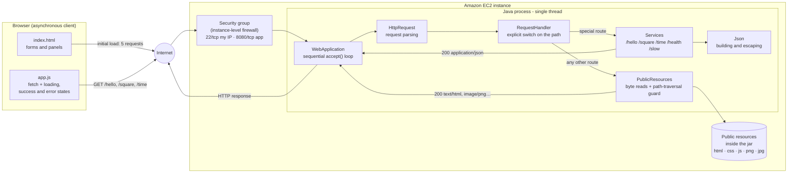
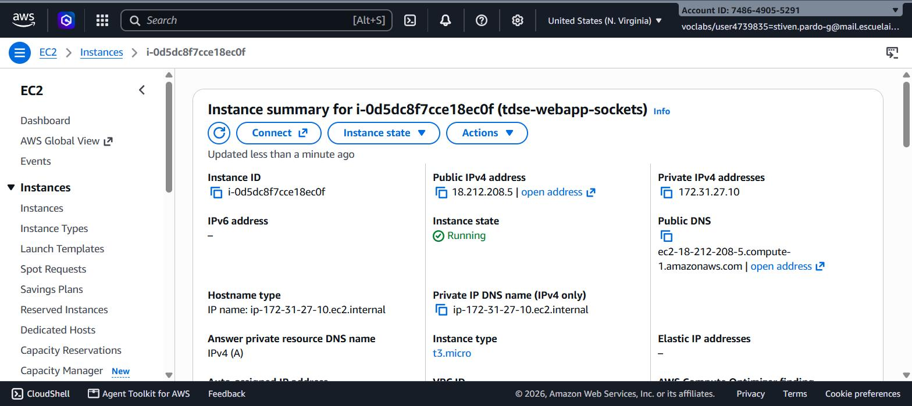
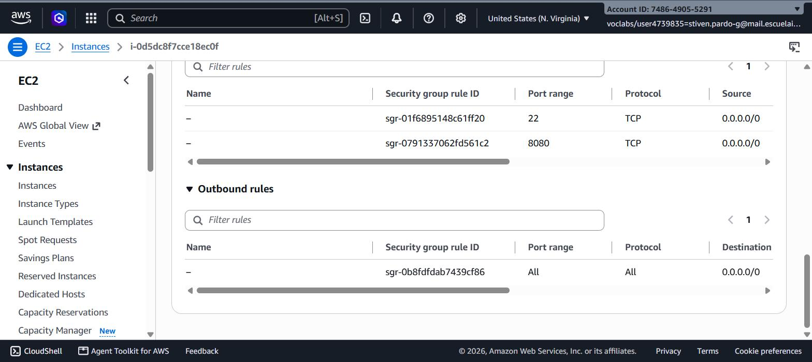
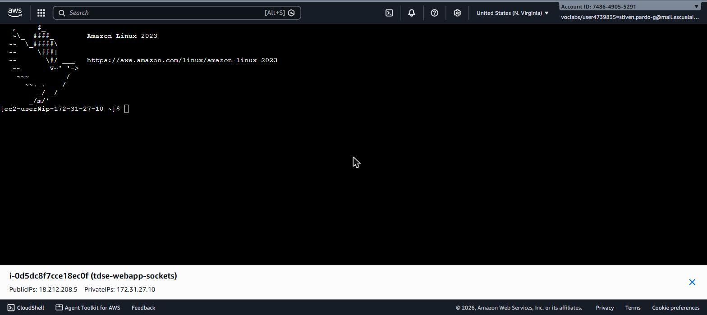
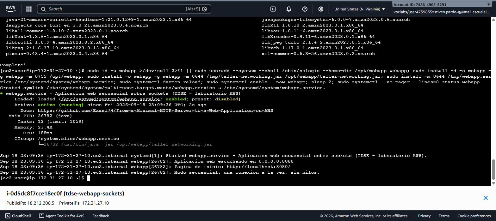
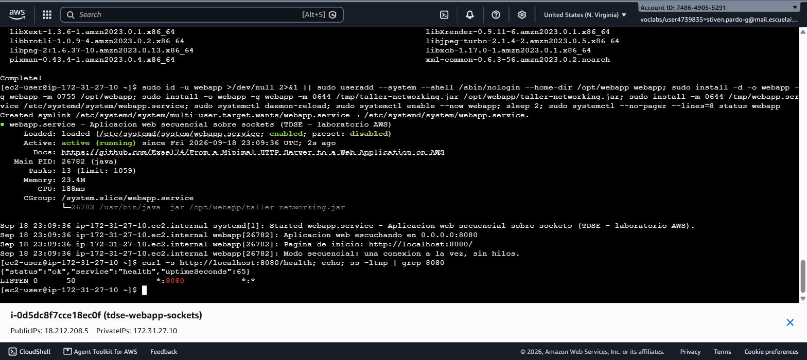
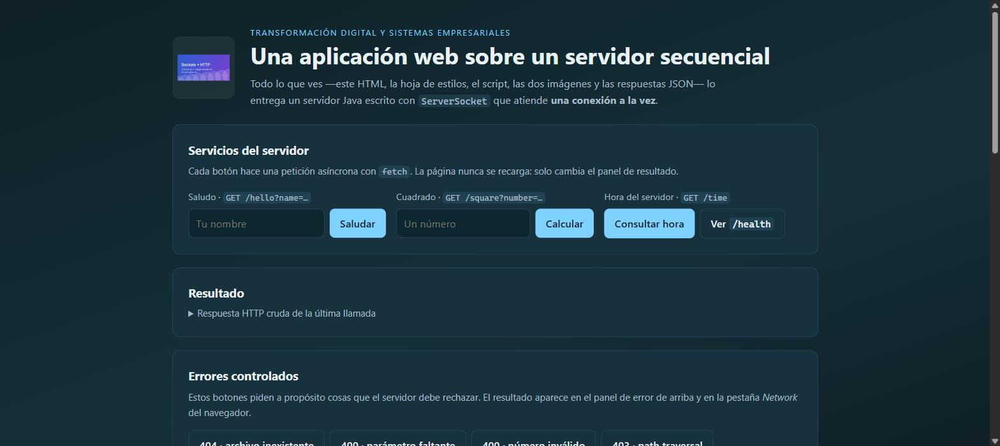
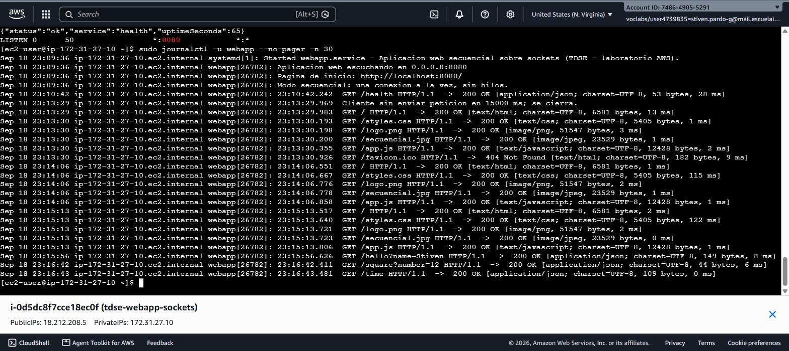
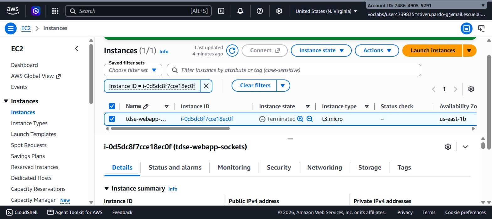

# From a Minimal HTTP Server to a Web Application on AWS

A complete web application — HTML page, asynchronous JavaScript, images and services that return
JSON — served by a **Java server written by hand on top of `ServerSocket`**: no web framework, no
servlet container and **no threads**. It handles one connection at a time.

The starting point is the minimal HTTP server from the networking workshop, which answered **a
single request** and terminated. This project grows it into an application that is deployed on an
**Amazon EC2** instance and answers from the Internet.

> **What problem it solves.** No production problem: it solves a problem of *understanding*. With
> no framework in the way, everything that is normally hidden becomes visible and has to be
> written by hand — separating headers from body, choosing the `Content-Type`, counting the bytes
> for `Content-Length`, deciding what is a 404 and what is a 403, and finding out first-hand where
> the ceiling of a one-request-at-a-time server actually is.

**Course:** Transformación Digital y Sistemas Empresariales 1 · Escuela Colombiana de Ingeniería
Julio Garavito · *Scalability and Elasticity: Designing Enterprise Systems That Grow*.

> **A note on language.** This README is in English. The application's user interface, the log
> messages and the source-code comments are in Spanish, which is the language of the course; every
> quoted output in this document is reproduced verbatim as the program prints it.

---

## Table of contents

- [The system metaphor](#the-system-metaphor)
- [Architecture](#architecture)
- [Design decisions](#design-decisions)
- [Project structure](#project-structure)
- [Prerequisites](#prerequisites)
- [Installation and build](#installation-and-build)
- [Running the application locally](#running-the-application-locally)
- [Using the application](#using-the-application)
- [Running the tests](#running-the-tests)
- [Deployment on AWS EC2](#deployment-on-aws-ec2)
- [Evidence and results](#evidence-and-results)
- [Reflection questions](#reflection-questions)
- [Known limitations](#known-limitations)
- [Author and acknowledgements](#author-and-acknowledgements)

---

## The system metaphor

> **A single service window, staffed by one clerk.**

The system metaphor, in the *Extreme Programming* sense, is a shared analogy that lets you talk
about the design without opening the code. Here it is a **public service office with one window
and one clerk**:

| In the office | In the system |
|---|---|
| The queue of people at the door | The queue of pending TCP connections in `accept()` |
| The clerk, just one | The server's single thread: `WebApplication` |
| The form each person fills in | The HTTP request line: `GET /square?number=5 HTTP/1.1` |
| The cabinet of already-printed documents | The static resources: HTML, CSS, JS, PNG, JPEG |
| The four procedures the clerk knows by heart | The hardcoded services: greeting, square, time, health |
| The "document type" stamp on every paper handed over | The `Content-Type` response header |
| "That file does not belong to this office" | The 403 on an attempt to escape the public directory |
| The person who starts a procedure and gets on with their day | The browser, which fires `fetch` and stays responsive |

What the metaphor makes obvious at once: **the fact that the person in the queue can do other
things while waiting does not mean there are two clerks.** An asynchronous client does not make a
sequential server concurrent. That is exactly the difference this lab measures in
[The sequential limit](#the-sequential-limit).

---

## Architecture



### What each component is responsible for

| Component | Responsible for | Not responsible for |
|---|---|---|
| `index.html` | Presenting the forms and the result and error panels | Computing anything; it only describes the interface |
| `app.js` | Validating input, building the URL, calling with `fetch`, showing loading / success / error | Rendering HTML coming from the server: it only writes text |
| `styles.css` | Presentation | Behaviour |
| `WebApplication` | Opening the `ServerSocket`, accepting **one connection at a time**, reading the request, writing the response and closing | Deciding *what* to answer |
| `HttpRequest` | Parsing the request line: method, path, version and the already-decoded query | Knowing what exists on the server |
| `RequestHandler` | Deciding, with an explicit `switch`, whether the path is a service or a static resource; validating the method | Reading from the socket |
| `Services` | The four hardcoded services plus the slow measurement service; validating parameters | Serialising HTTP |
| `PublicResources` | Translating a path into the bytes of a classpath resource and **rejecting anything outside the public directory** | Interpreting the content |
| `Json` | Building the JSON and **escaping** every client-supplied value | Knowing about HTTP |
| `HttpResponse` | Serialising status, headers and body into bytes | Knowing where the body came from |
| Security group | Being the instance's firewall: deciding which ports are reachable from the Internet | Anything about the app's behaviour |

### The path of one request

```
GET /square?number=12 HTTP/1.1
  │
  ├─ WebApplication.serve()      reads the request line and drains the headers
  ├─ HttpRequest.parse()         method=GET  path=/square  query={number=12}
  ├─ RequestHandler.handle()     is it a service route? yes → is it GET? yes
  ├─ Services.square()           validates, computes, builds the JSON
  ├─ HttpResponse.headerBytes()  200 OK · application/json · Content-Length: 44
  └─ socket closed               → back to accept()
```

---

## Design decisions

### Why the server is sequential

Because the point of the lab is to **see the ceiling**, not to dodge it. The loop accepts a
connection, serves it completely, closes it and goes back to `accept()`. There are no threads, no
thread pool, no `ExecutorService`, no asynchronous I/O. The consequence is measurable and it is
documented in the [evidence](#the-sequential-limit): while a slow request is being processed, the
others wait in the operating system's queue.

Two precautions that design forces you to take:

- **No exception from one connection may kill the loop.** Each connection is served inside a `try`
  that catches `IOException` and `RuntimeException`; a malformed request is answered with a 400 and
  the server stays up.
- **A 15-second read timeout per connection.** On a sequential server, a client that connects and
  sends nothing would block the single thread forever — and with it every other user.

### Why the routes are hardcoded

`RequestHandler` is a `switch` over the exact path. There is no route table, no wildcard patterns,
no path parameters, no dynamic handler registration, no annotations. **Adding a service means
editing the `switch` and recompiling.** That is, literally, the limitation a routing framework
exists to solve, and leaving it in plain sight is part of the exercise.

### How `Content-Type` is chosen

From the file extension, in `MimeTypes`. The browser does not guess: without `text/html` it would
show the page as plain text, and without `image/png` it would not paint the image. Services declare
`application/json; charset=UTF-8` because the client calls `response.json()`.

If the extension is **not** in the table, the resource is **not served** (404). A file we cannot
announce is a file this application does not need to serve.

### Why resources are read as bytes

The whole response path is `byte[]`, from the filesystem/classpath to the `OutputStream`. An image
that goes through a `Reader` is corrupted: the text decoder replaces every byte sequence that is
not valid UTF-8 with the replacement character, and `Content-Length` stops matching what is
actually sent. Only the headers are written in US-ASCII.

`Content-Length` is always computed from `body.length` — real bytes — never from the character
count of a `String`: in UTF-8 an "ñ" takes two bytes and an emoji takes four.

### How unsafe paths are rejected

`PublicResources` does three things before touching any resource:

1. **Decodes** the `%XX` escapes in the path. If the raw text were validated instead, a `%2e%2e`
   would pass the filter and turn into `..` afterwards. (`URLDecoder` is deliberately not used: it
   applies form rules and would turn a `+` in a file name into a space.)
2. **Rejects** the backslash and the null byte, which are path separators on other systems.
3. **Normalises by walking the segments with a stack**: a `..` pops the last segment and, if there
   is nothing left to pop, the request is trying to climb above the public root and gets a **403**.

Only after that is the resource looked up, and always under the `public/` prefix.

> A practical detail that only shows up when you test it: typing `/../pom.xml` in the address bar
> proves nothing, because the browser resolves the `..` **before** sending the request — even when
> written as `%2e%2e`. The form that does reach the server intact is `/..%2fpom.xml`, because
> browsers do not decode `%2f`. That is the one the UI's test button uses.

### Why the client is asynchronous

To separate two things that are easily confused: the **interface** not blocking, and the **server**
being concurrent. `app.js` uses `fetch`, shows a loading state, keeps the page interactive while it
waits and updates only the result panel. The server remains sequential. With the `/slow` service
that difference becomes visible within seconds.

The client distinguishes **three** outcomes, not two:

1. **Network failure** — the `fetch` rejects and there never was an HTTP response (`catch`).
2. **HTTP error response** — there was a response, with status ≥ 400 and its own message.
3. **Successful response** — the JSON is parsed and the interface is updated.

### How the JSON is protected

Every client-supplied value goes through `Json.escape` before entering the document: quotes,
backslashes, control characters and the JavaScript line separators (`U+2028` and `U+2029`). A name
like `a"b` does not break the response; it arrives as `"name":"a\"b"`. And on the client, received
values are written with `textContent`, never with `innerHTML`, so they cannot turn into markup
either.

### Why the public resources travel inside the jar

They live in `src/main/resources/public/`, so Maven packages them into the artifact. Deploying to
EC2 comes down to **copying one file**: there is no separate resources folder to keep in sync and
no guessing about the working directory of the systemd service.

### Why the port is configurable

Because it is decided at deployment time, not at programming time. On Linux, an unprivileged
process cannot listen below port 1024; the application runs on a high port and the security group
decides whether it is exposed. The resolution order is: **argument → `-Dapp.port` → the `PORT`
environment variable → 35000**.

And it listens on `0.0.0.0`, not on `127.0.0.1`: bound to loopback, the instance would answer
`curl localhost` but time out from the Internet — a symptom indistinguishable from a misconfigured
security group.

---

## Project structure

```
From-a-Minimal-HTTP-Server-to-a-Web-Application-on-AWS/
├── pom.xml                          Maven build; produces an executable jar
├── README.md
├── .gitignore
├── deploy/
│   ├── webapp.service               systemd unit for the EC2 instance
│   └── instalar-en-ec2.sh           Installs and starts the service on the instance
├── docs/
│   └── evidencias/                  Screenshots and transcripts of the runs
│       ├── local/
│       └── aws/
├── www/                             Public directory of the earlier file server (4.5.1)
└── src/
    ├── main/
    │   ├── java/edu/escuelaing/tdse/networking/
    │   │   ├── webapp/                      ← THE WEB APPLICATION OF THIS LAB
    │   │   │   ├── WebApplication.java      Sequential loop, configuration and startup
    │   │   │   ├── HttpRequest.java         Request-line and query parsing
    │   │   │   ├── RequestHandler.java      Explicit route switch
    │   │   │   ├── Services.java            The hardcoded services
    │   │   │   ├── PublicResources.java     Static resources and path-traversal guard
    │   │   │   └── Json.java                JSON building and escaping
    │   │   ├── web/                         Earlier HTTP servers (the starting point)
    │   │   │   ├── SingleRequestHttpServer.java   One single request
    │   │   │   ├── FileHttpServer.java            Successive requests + files
    │   │   │   ├── StaticFileResolver.java
    │   │   │   ├── HttpResponse.java        HTTP response (shared)
    │   │   │   └── MimeTypes.java           Extension → Content-Type (shared)
    │   │   ├── sockets/                     Earlier TCP socket exercises
    │   │   └── urls/                        Earlier java.net.URL exercises
    │   └── resources/public/                ← PUBLIC RESOURCES (packaged in the jar)
    │       ├── index.html                   The application's interface
    │       ├── app.js                       Asynchronous client
    │       ├── styles.css
    │       ├── logo.png                     image/png
    │       └── secuencial.jpg               image/jpeg
    └── test/
        ├── java/edu/escuelaing/tdse/networking/
        │   ├── webapp/                      78 tests for the web application
        │   ├── web/  sockets/  urls/
        └── resources/                       Test fixtures (alternate public root)
```

---

## Prerequisites

| Tool | Version | Check |
|---|---|---|
| **JDK** | 21 or newer (tested on JDK 23) | `java -version` |
| **Maven** | 3.9 or newer | `mvn -v` |
| Browser | Any with `fetch` and DevTools | — |
| `curl` | Optional, for testing from the terminal | `curl --version` |

The application has **no runtime dependencies**: only the Java standard library. JUnit 5 is used in
the tests only.

---

## Installation and build

```bash
git clone https://github.com/Exael74/From-a-Minimal-HTTP-Server-to-a-Web-Application-on-AWS.git
cd From-a-Minimal-HTTP-Server-to-a-Web-Application-on-AWS

mvn clean test        # compiles and runs the 122 tests
mvn clean package     # produces target/taller-networking.jar (executable, self-contained)
```

The resulting jar declares its `Main-Class` in the manifest and carries the public resources:

```bash
unzip -l target/taller-networking.jar | grep public/
```

---

## Running the application locally

```bash
java -jar target/taller-networking.jar
```

```
Aplicacion web escuchando en 0.0.0.0:35000
Pagina de inicio: http://localhost:35000/
Modo secuencial: una conexion a la vez, sin hilos.
```

Open **<http://localhost:35000/>**.

### Choosing the port

```bash
java -jar target/taller-networking.jar 8080        # argument
java -Dapp.port=8080 -jar target/taller-networking.jar
PORT=8080 java -jar target/taller-networking.jar   # the form systemd uses on EC2
```

### Shutting down

`Ctrl+C` in the terminal. A shutdown hook closes the `ServerSocket` and releases the port cleanly.

### Reading the log

Every served request prints one line with the time, the request line, the status, the
`Content-Type`, the byte count and the duration. It is direct evidence of the order in which
requests are served:

```
23:35:13.248  GET / HTTP/1.1  ->  200 OK [text/html; charset=UTF-8, 6581 bytes, 7 ms]
23:35:13.288  GET /styles.css HTTP/1.1  ->  200 OK [text/css; charset=UTF-8, 5405 bytes, 39 ms]
23:35:13.291  GET /logo.png HTTP/1.1  ->  200 OK [image/png, 51547 bytes, 2 ms]
23:35:13.292  GET /secuencial.jpg HTTP/1.1  ->  200 OK [image/jpeg, 23529 bytes, 1 ms]
23:35:13.304  GET /app.js HTTP/1.1  ->  200 OK [text/javascript; charset=UTF-8, 12428 bytes, 1 ms]
```

Those five lines answer the question "why does a single page generate several requests?": the HTML,
the stylesheet, the script and each image travel separately.

---

## Using the application

### The interface

| Area | What it does |
|---|---|
| **Servicios del servidor** | Name field → greeting · numeric field → square · buttons for time and health |
| **Resultado** | Success panel, error panel and the raw HTTP response of the last call |
| **Errores controlados** | Five buttons that deliberately ask for things the server must reject |
| **El límite secuencial** | Fires the slow service to measure the blocking |
| **Recursos estáticos** | The two images and direct links to each service |

No action reloads the page: only the result panel changes.

### The services

| Service | Request | Successful response | Errors |
|---|---|---|---|
| **Greeting** | `GET /hello?name=Ana` | `200` · `{"service":"greeting","name":"Ana","message":"Hola, Ana. …","timestamp":"…"}` | `400` if `name` is missing, blank or longer than 60 characters |
| **Square** | `GET /square?number=12` | `200` · `{"service":"square","input":12,"result":144}` | `400` if `number` is missing, not numeric or the result overflows |
| **Time** | `GET /time` | `200` · `{"service":"server-time","iso8601":"…","epochMillis":…,"zone":"America/Bogota"}` | — |
| **Health** | `GET /health` | `200` · `{"status":"ok","service":"health","uptimeSeconds":254}` | — |
| **Slow** | `GET /slow?seconds=5` | `200` · `{"service":"slow","seconds":5,"startedAt":"…","finishedAt":"…"}` | `400` outside the 0–10 range |

All of them are **stateless**: nothing about the client is kept between requests.

### Rules of the application

- Services answer **only to `GET`**; any other method gets a `405`.
- Static resources additionally accept `HEAD` (same headers, no body).
- Query parameters are **decoded** before being validated.
- Service errors are returned as **JSON**; file errors as HTML. The client calls `response.json()`
  and only understands the first format.
- Error messages are written for a person: no stack traces, no internal details.

### Testing from the terminal

```bash
curl -s http://localhost:35000/health
curl -s "http://localhost:35000/hello?name=Ana"
curl -s "http://localhost:35000/square?number=12"
curl -s http://localhost:35000/time

# Controlled errors
curl -s -o /dev/null -w "%{http_code}\n" http://localhost:35000/no-existe.html      # 404
curl -s -o /dev/null -w "%{http_code}\n" "http://localhost:35000/square?number=x"   # 400
curl -s -o /dev/null -w "%{http_code}\n" -X POST http://localhost:35000/index.html  # 405
curl -s -o /dev/null -w "%{http_code}\n" --path-as-is "http://localhost:35000/..%2fpom.xml"  # 403
```

---

## Running the tests

```bash
mvn test
```

**122 tests**, none of them depending on the Internet: the integration tests start the server on an
ephemeral port over the loopback interface.

| Test class | What it verifies |
|---|---|
| `JsonTest` (8) | Escaping of quotes, backslashes, newlines, control characters and hostile input; number formatting |
| `HttpRequestTest` (10) | Method, path, version, decoded query, `+` as space, fragment, malformed lines |
| `PublicResourcesTest` (16) | Index, MIME types, escaped paths, subdirectories, 404 on unknown extension, **403 in four path-traversal variants**, and that the real resources got packaged |
| `ServicesTest` (16) | The five services, their validations, JSON escaping, the clock frozen to a fixed instant, and the absence of state between calls |
| `RequestHandlerTest` (9) | Route dispatch, `405` by method, JSON vs HTML in errors |
| `WebApplicationTest` (19) | **Raw HTTP over real sockets**: status line, `Content-Length`, intact images, `HEAD` without body, 400/403/404/405, recovery after an invalid request, **10 consecutive operations** and **the automated demonstration of sequential blocking** |
| `FileHttpServerTest`, `StaticFileResolverTest`, `LineServerTest`, `SquareProtocolTest`, `MathFunctionProtocolTest`, `URLInspectorTest`, `MiniBrowserTest` (44) | The earlier socket and URL exercises this lab builds upon |

### Manual validation

The full functional test matrix is transcribed in
[`docs/evidencias/local/matriz-de-pruebas.txt`](docs/evidencias/local/matriz-de-pruebas.txt), with
the status and `Content-Type` of every case.

| Test | Result |
|---|---|
| Load the home page | HTML, CSS, JS and both images load, each in its own request |
| Valid greeting | The panel changes without a page reload |
| Valid number | The correct square is presented |
| Invalid number | `400` with a friendly message |
| Server time | The value comes from the server, not from the browser clock |
| Missing static file | `404` |
| Unsupported method | `405` |
| Path traversal attempt | `403`; no external file leaks |
| Repeated requests | 10 consecutive successful operations in a single server run |

---

## Deployment on AWS EC2

> Use the account, region, image, instance size and connection method **approved by the
> instructor**. A running instance costs money for as long as it exists.
>
> **Never** commit a private key (`.pem`), AWS credentials or your `~/.aws/credentials`.

### 1. Prepare the artifact

```bash
mvn clean package
java -jar target/taller-networking.jar 8080
curl -s http://localhost:8080/health
```

Testing the jar before uploading it separates two problems that look identical from the browser:
"the application is packaged wrong" and "the instance will not let me in".

### 2. Launch the instance

1. AWS console → **EC2** → *Launch instance*.
2. **Name**: `tdse-webapp-sockets`.
3. **AMI**: Amazon Linux 2023 (or the approved Linux image).
4. **Instance type**: the smallest approved one (`t2.micro` / `t3.micro`).
5. **Key pair**: yours, if you are going to use SSH. Not needed with Session Manager or EC2
   Instance Connect.
6. **Network settings**: default VPC and public subnet, with auto-assigned public IP.
7. **Security group**: only two inbound rules.

| Type | Port | Source | Purpose |
|---|---|---|---|
| SSH | 22 | **My IP** (`x.x.x.x/32`) | Administration. Never `0.0.0.0/0` |
| Custom TCP | 8080 | The range the instructor specifies; `0.0.0.0/0` only during the demo | The application |

If you connect through **Session Manager**, do not open port 22 at all: it is the safest option
because it exposes no administration port. The default outbound rule is left as is — the instance
needs it to download the Java package.

### 3. Transfer and install

```bash
# From your machine
scp -i ~/.ssh/mi-llave.pem \
    target/taller-networking.jar \
    deploy/webapp.service \
    deploy/instalar-en-ec2.sh \
    ec2-user@<PUBLIC-DNS>:/tmp/

# On the instance
ssh -i ~/.ssh/mi-llave.pem ec2-user@<PUBLIC-DNS>
sudo bash /tmp/instalar-en-ec2.sh 8080
```

The script [`deploy/instalar-en-ec2.sh`](deploy/instalar-en-ec2.sh) does five things:

1. installs `java-21-amazon-corretto-headless` with `dnf` (or `yum` on Amazon Linux 2);
2. creates the `webapp` system user, with no shell, and the `/opt/webapp` directory;
3. copies the jar;
4. installs the [`deploy/webapp.service`](deploy/webapp.service) unit, sets `PORT` and runs
   `systemctl enable --now webapp`;
5. verifies `/health` **from inside the instance**.

If you prefer to do it by hand, those are exactly the commands the script runs.

### 4. Verify in layers

The order matters: each step rules out a different cause.

```bash
systemctl status webapp                      # 1. is the process alive?
curl -s http://localhost:8080/health         # 2. does it answer inside the instance?
ss -ltnp | grep 8080                         # 3. is it on 0.0.0.0 and not on 127.0.0.1?
curl -s http://<PUBLIC-IP>:8080/health       # 4. from your machine: does it clear the security group?
```

If 2 works and 4 does not, the problem is the security group or the source IP, not the code.

Then, from the browser: **`http://<PUBLIC-IP>:8080/`**. The page must load its JS and both images
from EC2, and the services must answer through the public address.

### 5. Keeping it running

The application runs as a **systemd-managed service**: it starts on boot, restarts if the process
dies, stops cleanly and **survives closing the SSH session**.

```bash
sudo systemctl start webapp       # start
sudo systemctl stop webapp        # stop cleanly (SIGTERM → closes the ServerSocket)
sudo systemctl restart webapp     # restart, e.g. after copying a new jar
systemctl status webapp           # status
journalctl -u webapp -f           # live logs: one line per request
```

**Updating the application:**

```bash
mvn clean package
scp -i ~/.ssh/mi-llave.pem target/taller-networking.jar ec2-user@<PUBLIC-DNS>:/tmp/
# on the instance:
sudo install -o webapp -g webapp -m 0644 /tmp/taller-networking.jar /opt/webapp/
sudo systemctl restart webapp
```

### 6. Mandatory cleanup

- [ ] `sudo systemctl stop webapp` and save whatever logs or screenshots you need.
- [ ] **Terminate the instance**: EC2 → *Instance state* → *Terminate instance*. Make sure it ends
      up `terminated`, not `stopped` — a stopped instance still bills for its EBS volume.
- [ ] Release any **Elastic IP** you allocated: unattached, it bills by the hour.
- [ ] Delete the lab's **security group** once no instance uses it.
- [ ] Check *Billing and Cost Management*.

### Common problems

| Symptom | Likely cause | What to check |
|---|---|---|
| Timeout from the browser, but `curl localhost` works | The port is not open | Security group inbound rule |
| `Connection refused` from outside | The app listens only on loopback, or is not running | `ss -ltnp \| grep 8080` · `systemctl status webapp` |
| `Permission denied` when binding port 80 | On Linux, ports < 1024 require privileges | Use a high port (8080) |
| The service does not start | Java not installed or wrong jar path | `journalctl -u webapp -n 50` |
| The page loads but the images do not | Resources not packaged | `unzip -l taller-networking.jar \| grep public/` |
| Everything dies when SSH closes | The app was launched by hand, not as a service | Use systemd |

### Official AWS references

*Launch an Amazon EC2 instance* · *Connect to an EC2 instance* · *Connect to a Linux instance using
SSH* · *Security-group rules for common use cases* · *Create a security group*.

---

## Evidence and results

### Local run

**Server startup**

[`01-arranque-servidor.txt`](docs/evidencias/local/01-arranque-servidor.txt) — port, `0.0.0.0`
interface and sequential mode, straight from the process's own console output.

**Home page served by the Java server**


**Static resources: one page, five requests**

[`03-network-recursos-estaticos.txt`](docs/evidencias/local/03-network-recursos-estaticos.txt) —
HTML, CSS, JS, PNG and JPEG, each with its status and `Content-Type`.

**Asynchronous services**


**Controlled errors: 404, 400, 405 and 403**


[`07-errores-controlados.txt`](docs/evidencias/local/07-errores-controlados.txt) — the remaining
four cases (400 twice, 403, 405) with their status and `Content-Type`.

**Test suite**

[`09-pruebas-maven.txt`](docs/evidencias/local/09-pruebas-maven.txt) — output of `mvn clean test`
with all 122 tests passing.

**Transcripts**

- [`matriz-de-pruebas.txt`](docs/evidencias/local/matriz-de-pruebas.txt) — the full functional
  matrix run with `curl`: status and `Content-Type` of every case, the ten consecutive operations
  and the measurement of sequential blocking.
- [`registro-servidor.txt`](docs/evidencias/local/registro-servidor.txt) — the server log, one line
  per served request.

### The sequential limit

With `/slow` holding the single thread for 3 seconds, a request to `/health` fired half a second
later **takes 2.5 seconds to answer**: it waited for the first one to finish.

```
[7] Limite secuencial: una peticion lenta bloquea a la siguiente
    Lanzando GET /slow?seconds=3 en segundo plano...
    Respuesta de /slow  : {"service":"slow","seconds":3,"startedAt":"…23:39:45.037…","finishedAt":"…23:39:48.042…"}
    Respuesta de /health: {"status":"ok","service":"health","uptimeSeconds":282}
    La peticion a /health se lanzo 0.5 s despues y tardo 2513 ms en volver.
    Sin el bloqueo secuencial habria respondido en pocos milisegundos.
```

The browser **never freezes**: the page keeps accepting typing and clicks while it waits. That is
the proof that the client is asynchronous and the server is sequential, and that these are two
independent properties.

### Run on AWS EC2

**The instance and its security group**





**Installation and service**







**The application from the Internet**



[`07-network-remoto.txt`](docs/evidencias/aws/07-network-remoto.txt) — transcript of every request against
the public address: static resources and JSON services, each with its status and `Content-Type`.



**Cleanup**



---

## Reflection questions

**1. Why does a single HTML page generate several HTTP requests?**

Because HTTP transfers **one resource per request**. The browser first asks for the document; while
parsing it, it finds references — `<link>`, `<script>`, `` — and opens a new request for each
one. This project's home page generates five: HTML, CSS, JS, PNG and JPEG. The server log shows
them arriving one after the other.

**2. Why must images be handled as bytes and not as text?**

Because they are not text. A `Reader` decodes the input with a character set and replaces every
invalid UTF-8 sequence with the replacement character: the image arrives corrupted, and on top of
that `Content-Length` no longer matches what was sent, because the character count and the byte
count are no longer the same. By reading and writing `byte[]`, text and images travel the same path
without the content being touched.

**3. What is the role of the response `Content-Type`?**

Telling the client **how to interpret the bytes it just received**. Only bytes travel over the
socket, and they are identical for a page and for an image. With `text/html` the browser renders,
with `image/png` it paints, with `application/json` the `fetch` can call `.json()`. Without the
right header, the same body is shown as plain text or offered as a download.

**4. What is hardcoded in this design, and what would a routing framework generalise?**

What is hardcoded is the dispatch: a `switch` over literal paths, the allowed method per branch,
the parameter names, the response format of each service and the extension → MIME table. A
framework would generalise route registration (patterns, path variables, methods), parameter
extraction and conversion, content negotiation, automatic JSON serialisation and uniform error
handling. Here, **adding a service forces you to edit the `switch` and recompile** — the limitation
is right there in plain sight.

**5. Why can the browser stay responsive while the server remains sequential?**

Because they are two different threads of execution and two different problems. `fetch` does not
block the UI thread: the request stays pending and the browser keeps handling events, so the page
accepts typing and clicks while it waits. That changes nothing on the other side of the socket: the
server still has one thread and one request in flight. **Client asynchrony and server concurrency
are independent properties.**

**6. What changed when the server moved to EC2? What did NOT change?**

*What changed* is everything around the process: the name it is reached by (a public IP or DNS
instead of `localhost`), real network latency, the fact that a firewall — the security group — now
decides who reaches the port, the need to listen on `0.0.0.0`, and the process lifecycle, which
moves to systemd so it survives the session closing.

*Nothing about the program changed.* Same jar, same sequential loop, same capacity. Moving a system
to the cloud does not make it scalable; it only changes where it runs.

**7. What happens when two users send slow requests at almost the same time?**

They are served **in series**. The first one occupies the single thread; the second connection is
accepted by the operating system's queue, but it is neither read nor answered until the first one
finishes. The second user waits the duration of the first one *plus* their own. Measured in this
project: with `/slow?seconds=3` in flight, a `/health` fired half a second later took 2513 ms. With
more users the waits pile up linearly, and once the queue fills up the operating system starts
refusing connections.

**8. What is the next architectural limitation you would attack, and why should concurrency come
before load balancing?**

The next limitation is the **single thread**: a thread pool would let several requests progress at
once and would multiply throughput without touching a line of business logic.

Concurrency comes first for arithmetic reasons. A load balancer spreads traffic across instances,
but if each instance still serves **one request at a time**, doubling the instances only doubles
that minimal capacity: you pay twice the compute to go from 1 to 2 simultaneous requests, while
every machine leaves its remaining cores idle. First you make use of the machine you are already
paying for — concurrency inside the process; only when a well-utilised instance falls short does it
make sense to put several of them behind a balancer. Scaling out before scaling up inside the
process is multiplying an inefficiency.

---

## Known limitations

This server **is not a production-ready HTTP server**, and the lab asks for exactly that:

- **Sequential.** One connection at a time. It is the central limitation and it is deliberate.
- **No persistent connections.** Every response declares `Connection: close`; there is no
  `keep-alive` and no HTTP/2.
- **`GET` and `HEAD` only.** No `POST`, no request bodies, no file uploads.
- **Hardcoded services.** No route table, no path parameters.
- **No persistence.** No database and no state between requests.
- **No authentication or authorisation.** Anyone who reaches the port can call everything.
- **No TLS.** Traffic travels in the clear over HTTP.
- **Request headers ignored.** They are read to drain the stream but not interpreted: no content
  negotiation, no conditional caching, no `Range`.
- **No size limit on the request line** beyond the read timeout.
- **A single instance.** No load balancer, no autoscaling, no containers.

---

## Author and acknowledgements

**Stiven Esneider Pardo Gutiérrez** ([@Exael74](https://github.com/Exael74))
Systems Engineering · Escuela Colombiana de Ingeniería Julio Garavito
Transformación Digital y Sistemas Empresariales 1 — 2026-2

### Acknowledgements and sources

- **Luis Daniel Benavides Navarro**, for the lab statement and the networking guide (*Networking:
  Introduction to Naming, Networks, Clients, and Services with Java*), the source of the minimal
  HTTP server this project extends.
- **The Java Tutorials** by Oracle, chapters *All About Sockets* and *Working with URLs*, the basis
  of the `Socket`, `ServerSocket` and `java.net.URL` exercises.
- **RFC 9110 (HTTP Semantics)** and **RFC 9112 (HTTP/1.1)**, for status codes, response structure
  and the handling of `HEAD`.
- **MDN Web Docs**, for the `fetch` API, form event handling and URL encoding rules.
- **Official AWS documentation**: *Launch an Amazon EC2 instance*, *Connect to an EC2 instance*,
  *Security-group rules for common use cases*.
- **systemd documentation** (`systemd.service`, `systemd.exec`), for the service unit and its
  hardening options.

No third-party dependencies: the application uses only the Java standard library. JUnit 5 is used
exclusively in the tests.
